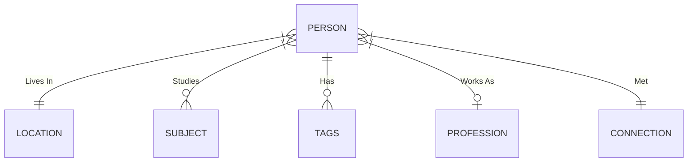

- [[s.q.tsql]] 
  - Databases can live in a single `.db` file
  - queries have to end with a `;`
  - The syntax is similar to other SQL's but it of course has it differences and functionalities that it lacks
  - Cant seem to find a way to do a string split cross apply with SQLite to take a single column with a string of values comma separated to split them then cross apply them to list and then filter/aggregate them.
    - This is making me rely more of more tables in the relational model v.s. robust functions.
 ## Current ER diagram looking like this:


    

- csv
- clojure
  - looked at clojure a little bit but immediately decided against looking into it further since apparently it's meant to run on a JVM or java Virtual Machine.
  - I have no intention of looking into Java right now so that was a quick foray into the weird looking syntax of Clojure. maybe something like lisp/elisp for emacs will be more interesting and applicable for me.
- markdown markdown hyperlinks when separated by declaration and definition, they can be re-used!
  
```markdown
[link text][1]

[1]: https://www.bryanjenks.dev

[but I can also re-use the link here!][1]

And this will work all throughout a markdown document
```

- CompTIA A+ Core2 1002 completed [this udemy course](https://www.udemy.com/course/comptia-220-1002-exam/) to prep for the exam.
- [[cli.cmd.git]] Found [this GREAT graphical walkthrough tool](https://learngitbranching.js.org/) for learning git
