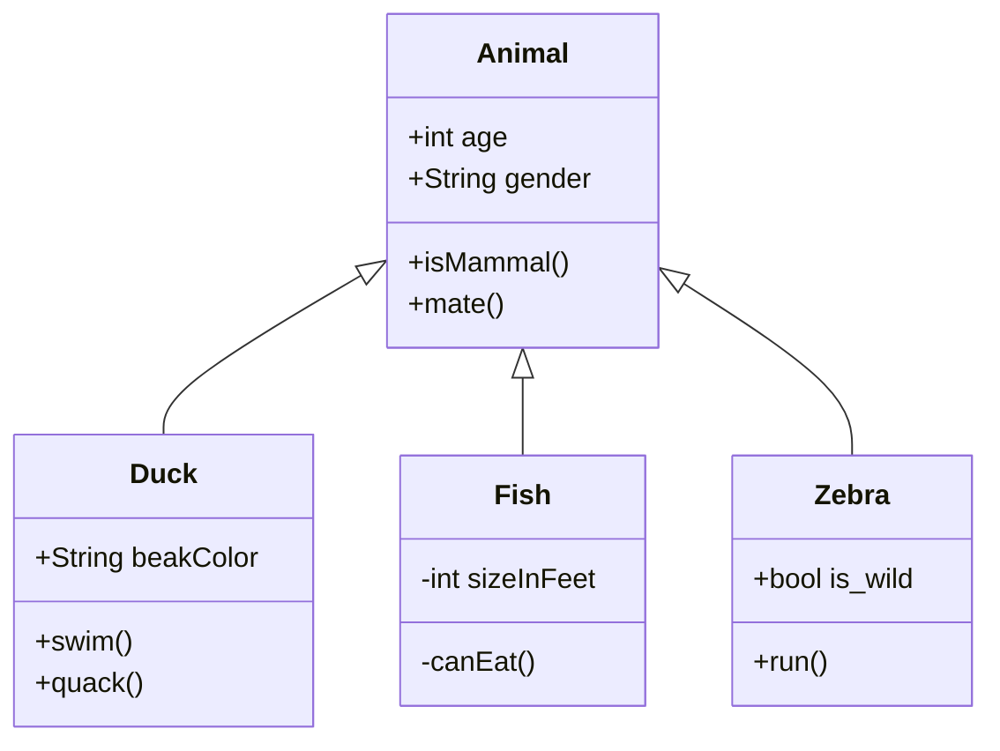

### Class Diagrams

````

````

<div class="mermaid">
  %% https://mermaid-js.github.io/mermaid/#/classDiagram
 classDiagram
      Animal <|-- Duck
      Animal <|-- Fish
      Animal <|-- Zebra
      Animal : +int age
      Animal : +String gender
      Animal: +isMammal()
      Animal: +mate()
      class Duck{
          +String beakColor
          +swim()
          +quack()
      }
      class Fish{
          -int sizeInFeet
          -canEat()
      }
      class Zebra{
          +bool is_wild
          +run()
      }
</div>

[mermaid live editor](https://mermaid-js.github.io/mermaid-live-editor/#/edit/eyJjb2RlIjoiY2xhc3NEaWFncmFtXG4gICAgQW5pbWFsIDx8LS0gRHVja1xuICAgIEFuaW1hbCA8fC0tIEZpc2hcbiAgICBBbmltYWwgPHwtLSBaZWJyYVxuICAgIEFuaW1hbCA6ICtpbnQgYWdlXG4gICAgQW5pbWFsIDogK1N0cmluZyBnZW5kZXJcbiAgICBBbmltYWw6ICtpc01hbW1hbCgpXG4gICAgQW5pbWFsOiArbWF0ZSgpXG4gICAgY2xhc3MgRHVja3tcbiAgICAgICtTdHJpbmcgYmVha0NvbG9yXG4gICAgICArc3dpbSgpXG4gICAgICArcXVhY2soKVxuICAgIH1cbiAgICBjbGFzcyBGaXNoe1xuICAgICAgLWludCBzaXplSW5GZWV0XG4gICAgICAtY2FuRWF0KClcbiAgICB9XG4gICAgY2xhc3MgWmVicmF7XG4gICAgICArYm9vbCBpc193aWxkXG4gICAgICArcnVuKClcbiAgICB9XG4gICAgICAgICAgICAiLCJtZXJtYWlkIjp7InRoZW1lIjoiZGVmYXVsdCJ9LCJ1cGRhdGVFZGl0b3IiOmZhbHNlfQ)
