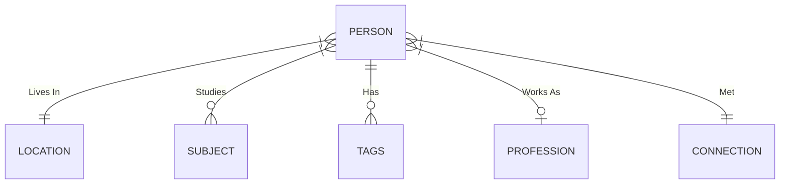

## [[SQL]]
### [[SQLite]]
#### Databases can live in a single `.db` file
#### queries have to end with a `;`
#### The syntax is similar to other SQL's but it of course has it differences and functionalities that it lacks
#### Cant seem to find a way to do a string split cross apply with SQLite to take a single column with a string of values comma separated to split them then cross apply them to list and then filter/aggregate them.
##### This is making me rely more of more tables in the relational model v.s. robust functions.
#### Current ER diagram looking like this:
##### 

##### @@html: <iframe  src="https://mermaid.ink/img/eyJjb2RlIjoiZXJEaWFncmFtXG4gICAgICAgICAgUEVSU09OIH18LS18fCBMT0NBVElPTiA6IFwiTGl2ZXMgSW5cIlxuICAgICAgICAgIFBFUlNPTiB9fC0tb3sgU1VCSkVDVCA6IFN0dWRpZXNcbiAgICAgICAgICBQRVJTT04gfHwtLW97IFRBR1MgOiBIYXNcbiAgICAgICAgICBQRVJTT04gfXwtLW98IFBST0ZFU1NJT04gOiBcIldvcmtzIEFzXCJcbiAgICAgICAgICBQRVJTT04gfXwtLXx8IENPTk5FQ1RJT04gOiBNZXQiLCJtZXJtYWlkIjp7fSwidXBkYXRlRWRpdG9yIjpmYWxzZX0" height=300></iframe>@@
## [[CSV]]
### Excel files saved to CSV's will convert [[ISO 8601]] dates from _"2021-04-23"_ to _"4/23/2021"_ on save automatically.
## [[Clojure]]
### looked at clojure a little bit but imediately decided against
