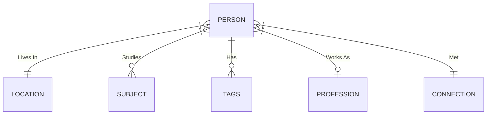

## [[SQL]]
### [[SQLite]]
#### Databases can live in a single `.db` file
#### queries have to end with a `;`
#### The syntax is similar to other SQL's but it of course has it differences and functionalities that it lacks
#### Cant seem to find a way to do a string split cross apply with SQLite to take a single column with a string of values comma separated to split them then cross apply them to list and then filter/aggregate them.
##### This is making me rely more of more tables in the relational model v.s. robust functions.
#### Current ER diagram looking like this:
##### 

##### @@html: <iframe  src="https://mermaid.ink/img/eyJjb2RlIjoiZXJEaWFncmFtXG4gICAgICAgICAgUEVSU09OIH18LS18fCBMT0NBVElPTiA6IFwiTGl2ZXMgSW5cIlxuICAgICAgICAgIFBFUlNPTiB9fC0tb3sgU1VCSkVDVCA6IFN0dWRpZXNcbiAgICAgICAgICBQRVJTT04gfHwtLW97IFRBR1MgOiBIYXNcbiAgICAgICAgICBQRVJTT04gfXwtLW98IFBST0ZFU1NJT04gOiBcIldvcmtzIEFzXCJcbiAgICAgICAgICBQRVJTT04gfXwtLXx8IENPTk5FQ1RJT04gOiBNZXQiLCJtZXJtYWlkIjp7fSwidXBkYXRlRWRpdG9yIjpmYWxzZX0" height=300></iframe>@@
## [[CSV]]
### Excel files saved to CSV's will convert [[ISO 8601]] dates from _"2021-04-23"_ to _"4/23/2021"_ on save automatically.
## [[Clojure]]
### looked at clojure a little bit but immediately decided against looking into it further since apparently it's meant to run on a JVM or [[Java]] Virtual Machine.
### I have no intention of looking into Java right now so that was a quick foray into the weird looking syntax of Clojure. maybe something like [[Lisp]]/[[ELisp]] for [[EMACS]] will be more interesting and applicable for me.
## [[Markdown]]
### markdown hyperlinks when separated by declaration and definition, they can be re-used!
###
```md
[link text][1]

[1]: https://www.bryanjenks.dev

[but i can also re-use the link here!][1]

<!-- And this will work all throughout a markdown document -->
```
##
```sql
CREATE TABLE PERSON (
    ID INTEGER PRIMARY KEY AUTOINCREMENT NOT NULL,
    firstName VARCHAR(255) NOT NULL,
    middleName VARCHAR(255),
    lastName VARCHAR(255),
    age INTEGER,
    address VARCHAR(500),
    email VARCHAR(150),
    phone VARCHAR(100),
    leatherCustomer BOOLEAN NOT NULL,
    location INTEGER,
    hasAssociates INTEGER,
    associateSubject INTEGER,
    hasBachelors INTEGER,
    bachelorsSubject INTEGER,
    hasMasters INTEGER,
    mastersSubject INTEGER,
    hasPhd INTEGER,
    phdSubject INTEGER,
    profession INTEGER,
    discord VARCHAR(255),
    Facebook VARCHAR(255),
    github VARCHAR(255),
    instagram VARCHAR(255),
    linkedin VARCHAR(255),
    medium VARCHAR(255),
    patreon VARCHAR(255),
    reddit VARCHAR(255),
    tumblr VARCHAR(255),
    twitch VARCHAR(255),
    twitter VARCHAR(255),
    youtube VARCHAR(255),
    website VARCHAR(255),
    connectionPoint INTEGER
```
##
