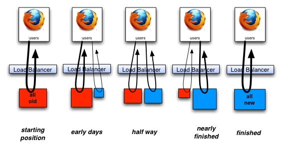
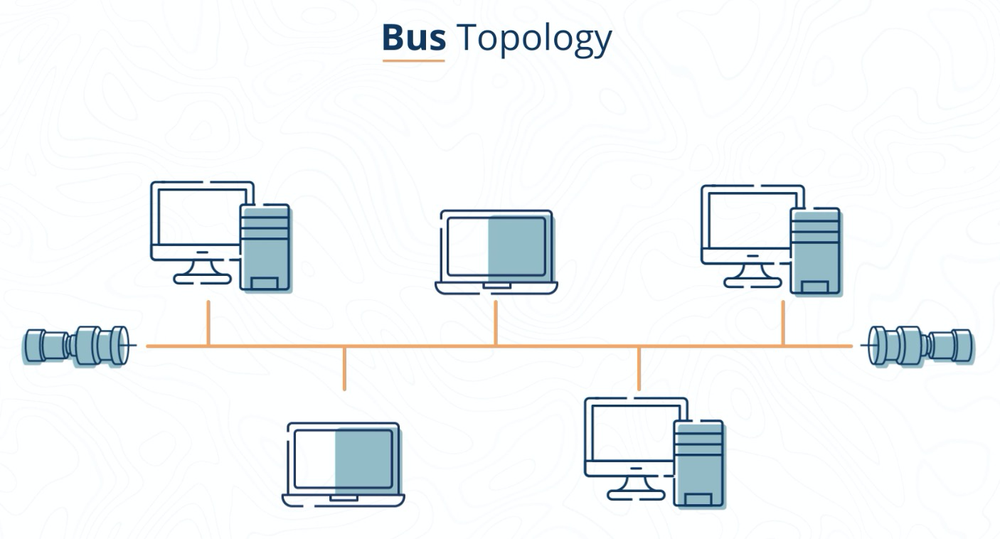

- setting up devlog onto github pages with publish, using the desktop app, github cron job for auto push sync, and just figuring out the whole shenanigans.
- I finished getting my [[Git]] sync [[PowerShell]] script setup on windows [[Task Scheduler]] so now i have a live sync of my DevLog using the desktop app and windows!
	- Clunky but it will do
- DONE [[Python]] [[parse]] [parse library for common string parsing](https://calmcode.io/parse/parse.html)
- TODO [[SQL]] to view [[SSIS]] packages in the visual programming interface within [[Visual Studio]]:
	- Need to have the SQL data Tools installed from the `tools and features` menu in visual studio
	- Install the extension for `SQL Server Integration Services Project` to view the [[XML]] as a GUI visual programming interface
- DONE [[Python]] [The Controversy Behind The Walrus Operator in Python](https://dev.to/renegadecoder94/the-controversy-behind-the-walrus-operator-in-python-4k4e)
- DONE [[Python]] [The Most Controversial Python Walrus Operator](https://pythonsimplified.com/the-most-controversial-python-walrus-operator/)
- DONE [[Python]] [Dustin Ingram - PEP 572: The Walrus Operator - PyCon 2019](https://youtu.be/6uAvHOKofws)
- DONE [strangler fig application](https://martinfowler.com/bliki/StranglerFigApplication.html) 
  done:: 1625766726051
  SCHEDULED: <2021-07-08 Thu>
- DONE [strangler applications](https://paulhammant.com/2013/07/14/legacy-application-strangulation-case-studies/)
  done:: 1625767058892
  SCHEDULED: <2021-07-08 Thu>
<<<<<<< HEAD
	- 
- DONE [[Python]] [python azure docs](https://docs.microsoft.com/en-us/azure/developer/python/) 
  done:: 1625767314235
  SCHEDULED: <2021-07-08 Thu>
=======
- TODO [[Python]] [python azure docs](https://docs.microsoft.com/en-us/azure/developer/python/) 
  todo:: 1625702928748
  SCHEDULED: <2021-07-08 Thu>
- CIA Triad:
  collapsed:: true
	- 
- AAA categories:
  collapsed:: true
	- 
- Network Topologies
  collapsed:: true
	- Star
	  collapsed:: true
		- The most common topology such as around a router or WAP
		- 
	- Bus
	  collapsed:: true
		- Terminators at either end of the connection which is a single cable and other devices tap into this cable for connectivity.
		- should the cable get cut this can cause a loss of connectivity as well as a lot of excess noise
		- 
		- 
	- Ring
	  collapsed:: true
		- rare, if only 1 ring in 1 direction, a cut cable renders the topology useless, dual ring can help prevent this but this is not commonly used anymore
		- 
	- Mesh
	  collapsed:: true
		- Not as common, used to connect every device directly to ever other device. LOTS of cables used
		- 
- Penetration Testing Team Color definitions
  collapsed:: true
	- 
	- https://danielmiessler.com/study/red-blue-purple-teams/
-
>>>>>>> a3d3fb66f2f90dd5c48e2acdd15b16b2d48c709d
